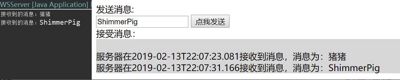

# Netty+SpringBoot+FastDFS+MUI实现聊天App详解(一)

# Netty学习

## IO编程与NIO编程

### 传统IO编程性能分析

IO编程模型在客户端较少的情况下运行良好，但是对于客户端比较多的业务来说，单机服务端可能需要支撑成千上万的连接，IO模型可能就不太合适了。这是因为在传统的IO模型中，每个连接创建成功之后都需要一个线程来维护，每个线程包含一个while死循环，那么1w个连接对应1w个线程，继而1w个while死循环，这就带来如下几个问题：

1.线程资源受限：线程是操作系统中非常宝贵的资源，同一时刻有大量的线程处于阻塞状态是非常严重的资源浪费，操作系统耗不起。

2.线程切换效率低下：单机cpu核数固定，线程爆炸之后操作系统频繁进行线程切换，应用性能急剧下降。

3.除了以上两个问题，IO编程中，我们看到数据读写是以字节流为单位，效率不高。

为了解决这三个问题，JDK在1.4之后提出了NIO。下面简单描述一下NIO是如何解决以上三个问题的。

### 线程资源受限

NIO编程模型中，新来一个连接不再创建一个新的线程，而是可以把这条连接直接绑定到某个固定的线程，然后这条连接所有的读写都由这个线程来负责。
	这个过程的实现归功于NIO模型中selector的作用，一条连接来了之后，现在不创建一个while死循环去监听是否有数据可读了，而是直接把这条连接注册到selector上，然后，通过检查这个selector，就可以批量监测出有数据可读的连接，进而读取数据。

### 线程切换效率低下

由于NIO模型中线程数量大大降低，线程切换效率因此也大幅度提高。

### IO读写以字节为单位

NIO解决这个问题的方式是数据读写不再以字节为单位，而是以字节块为单位。IO模型中，每次都是从操作系统底层一个字节一个字节地读取数据，而NIO维护一个缓冲区，每次可以从这个缓冲区里面读取一块的数据。

## hello netty

完整代码，附在文末。

首先定义一对线程组——主线程bossGroup与从线程workerGroup。

bossGroup——用于接受客户端的连接，但是不做任何处理，跟老板一样，不做事。

workerGroup——bossGroup会将任务丢给他，让workerGroup去处理。

```java
//主线程
EventLoopGroup bossGroup = new NioEventLoopGroup();
//从线程
EventLoopGroup workerGroup = new NioEventLoopGroup();
```

定义服务端的启动类serverBootstrap，需要设置主从线程，NIO的双向通道，与子处理器（用于处理workerGroup），这里的子处理器后面我们会手动创建。

```java
// netty服务器的创建, ServerBootstrap 是一个启动类
            ServerBootstrap serverBootstrap = new ServerBootstrap();
            serverBootstrap.group(bossGroup, workerGroup)            // 设置主从线程组
                            .channel(NioServerSocketChannel.class)    // 设置nio的双向通道
                            .childHandler(new HelloServerInitializer()); // 子处理器，用于处理workerGroup
```

启动服务端，绑定8088端口，同时设置启动的方式为同步的，这样我们的Netty就会一直等待，直到该端口启动完毕。

```java
ChannelFuture channelFuture = serverBootstrap.bind(8088).sync();
```

监听关闭的通道channel，设置为同步方式。

```java
channelFuture.channel().closeFuture().sync();
```

将两个线程优雅地关闭。

```java
bossGroup.shutdownGracefully();
workerGroup.shutdownGracefully();
```

创建管道channel的子处理器HelloServerInitializer，用于处理workerGroup。

HelloServerInitializer里面只重写了initChannel方法，是一个初始化器，channel注册后，会执行里面相应的初始化方法。

在initChannel方法中通过SocketChannel获得对应的管道，通过该管道添加相关助手类handler。

HttpServerCodec是由netty自己提供的助手类，可以理解为拦截器，当请求到服务端，我们需要做解码，响应到客户端做编码。

添加自定义的助手类customHandler，返回"hello netty~"

```java
ChannelPipeline pipeline = channel.pipeline();
pipeline.addLast("HttpServerCodec", new HttpServerCodec());
pipeline.addLast("customHandler", new CustomHandler());
```

创建自定义的助手类CustomHandler继承SimpleChannelInboundHandler，返回hello netty~

重写channelRead0方法，首先通过传入的上下文对象ChannelHandlerContext获取channel，若消息类型为http请求，则构建一个内容为"hello netty~"的http响应，通过上下文对象的writeAndFlush方法将响应刷到客户端。

```java
if (msg instanceof HttpRequest) {
    // 显示客户端的远程地址
    System.out.println(channel.remoteAddress());
    
    // 定义发送的数据消息
    ByteBuf content = Unpooled.copiedBuffer("Hello netty~", CharsetUtil.UTF_8);
    
    // 构建一个http response
    FullHttpResponse response = 
        new DefaultFullHttpResponse(HttpVersion.HTTP_1_1, 
                HttpResponseStatus.OK, 
                content);
    // 为响应增加数据类型和长度
    response.headers().set(HttpHeaderNames.CONTENT_TYPE, "text/plain");
    response.headers().set(HttpHeaderNames.CONTENT_LENGTH, content.readableBytes());
    
    // 把响应刷到客户端
    ctx.writeAndFlush(response);
}
```

访问8088端口，返回"hello netty~"


## netty聊天小练习

完整代码，附在文末。

### 服务器

定义主从线程与服务端的启动类

```java
public class WSServer {
    public static void main(String[] args) throws Exception {   
        EventLoopGroup mainGroup = new NioEventLoopGroup();
        EventLoopGroup subGroup = new NioEventLoopGroup();
        
        try {
            ServerBootstrap server = new ServerBootstrap();
            server.group(mainGroup, subGroup)
                .channel(NioServerSocketChannel.class)
                .childHandler(new WSServerInitialzer());
            
            ChannelFuture future = server.bind(8088).sync();
            
            future.channel().closeFuture().sync();
        } finally {
            mainGroup.shutdownGracefully();
            subGroup.shutdownGracefully();
        }
    }
}
```

创建channel的子处理器WSServerInitialzer

加入相关的助手类handler

```java
public class WSServerInitialzer extends ChannelInitializer<SocketChannel> {
    @Override
    protected void initChannel(SocketChannel ch) throws Exception {
        ChannelPipeline pipeline = ch.pipeline();
        
        // websocket 基于http协议，所以要有http编解码器
        pipeline.addLast(new HttpServerCodec());
        // 对写大数据流的支持 
        pipeline.addLast(new ChunkedWriteHandler());
        // 对httpMessage进行聚合，聚合成FullHttpRequest或FullHttpResponse
        // 几乎在netty中的编程，都会使用到此hanler
        pipeline.addLast(new HttpObjectAggregator(1024*64));
        
        // ====================== 以上是用于支持http协议    ======================
        
        // ====================== 以下是支持httpWebsocket ======================
        
        /**
         * websocket 服务器处理的协议，用于指定给客户端连接访问的路由 : /ws
         * 本handler会帮你处理一些繁重的复杂的事
         * 会帮你处理握手动作： handshaking（close, ping, pong） ping + pong = 心跳
         * 对于websocket来讲，都是以frames进行传输的，不同的数据类型对应的frames也不同
         */
        pipeline.addLast(new WebSocketServerProtocolHandler("/ws"));
        
        // 自定义的handler
        pipeline.addLast(new ChatHandler());
    }
}
```

创建自定义的助手类ChatHandler，用于处理消息。

TextWebSocketFrame: 在netty中，是用于为websocket专门处理文本的对象，frame是消息的载体。
创建管道组ChannelGroup，用于管理所有客户端的管道channel。

```java
private static ChannelGroup clients = new DefaultChannelGroup(GlobalEventExecutor.INSTANCE);
```

重写channelRead0方法，通过传入的TextWebSocketFrame获取客户端传入的内容。通过循环的方法对ChannelGroup中所有的channel进行回复。

```java
@Override
protected void channelRead0(ChannelHandlerContext ctx, TextWebSocketFrame msg) 
throws Exception {
    // 获取客户端传输过来的消息
    String content = msg.text();
    System.out.println("接受到的数据：" + content);

//        for (Channel channel: clients) {
//            channel.writeAndFlush(
//                new TextWebSocketFrame(
//                        "[服务器在]" + LocalDateTime.now() 
//                        + "接受到消息, 消息为：" + content));
//        }
    // 下面这个方法，和上面的for循环，一致
    clients.writeAndFlush(
    new TextWebSocketFrame(
            "[服务器在]" + LocalDateTime.now() 
            + "接受到消息, 消息为：" + content));

}
```

重写handlerAdded方法，当客户端连接服务端之后（打开连接），获取客户端的channle，并且放到ChannelGroup中去进行管理。

```java
@Override
public void handlerAdded(ChannelHandlerContext ctx) throws Exception {
    clients.add(ctx.channel());
}
```

重写handlerRemoved方法，当触发handlerRemoved，ChannelGroup会自动移除对应客户端的channel。

```java
@Override
public void handlerRemoved(ChannelHandlerContext ctx) throws Exception {
    // 当触发handlerRemoved，ChannelGroup会自动移除对应客户端的channel
    //        clients.remove(ctx.channel());
    System.out.println("客户端断开，channle对应的长id为："  + ctx.channel().id().asLongText());
    System.out.println("客户端断开，channle对应的短id为："  + ctx.channel().id().asShortText());
}
```

### 客户端

```html
<!DOCTYPE html>
<html>
    <head>
        <meta charset="utf-8" />
        <title></title>
    </head>
    <body>
        
        <div>发送消息:</div>
        <input type="text" id="msgContent"/>
        <input type="button" value="点我发送" onclick="CHAT.chat()"/>
        
        <div>接受消息：</div>
        <div id="receiveMsg" style="background-color: gainsboro;"></div>
        
        <script type="application/javascript">
            
            window.CHAT = {
                socket: null,
                init: function() {
                    if (window.WebSocket) {
                        CHAT.socket = new WebSocket("ws://192.168.1.4:8088/ws");
                        CHAT.socket.onopen = function() {
                            console.log("连接建立成功...");
                        },
                        CHAT.socket.onclose = function() {
                            console.log("连接关闭...");
                        },
                        CHAT.socket.onerror = function() {
                            console.log("发生错误...");
                        },
                        CHAT.socket.onmessage = function(e) {
                            console.log("接受到消息：" + e.data);
                            var receiveMsg = document.getElementById("receiveMsg");
                            var html = receiveMsg.innerHTML;
                            receiveMsg.innerHTML = html + "<br/>" + e.data;
                        }
                    } else {
                        alert("浏览器不支持websocket协议...");
                    }
                },
                chat: function() {
                    var msg = document.getElementById("msgContent");
                    CHAT.socket.send(msg.value);
                }
            };
            
            CHAT.init();
            
        </script>
    </body>
</html>
```

### 测试



## hello netty(完整代码)

```java
/**
 * @Description: 实现客户端发送一个请求，服务器会返回 hello netty
 */
public class HelloServer {
	public static void main(String[] args) throws Exception {
		// 定义一对线程组
		// 主线程组, 用于接受客户端的连接，但是不做任何处理，跟老板一样，不做事
		EventLoopGroup bossGroup = new NioEventLoopGroup();
		// 从线程组, 老板线程组会把任务丢给他，让手下线程组去做任务
		EventLoopGroup workerGroup = new NioEventLoopGroup();
		
		try {
			// netty服务器的创建, ServerBootstrap 是一个启动类
			ServerBootstrap serverBootstrap = new ServerBootstrap();
			serverBootstrap.group(bossGroup, workerGroup)			// 设置主从线程组
							.channel(NioServerSocketChannel.class)	// 设置nio的双向通道
							.childHandler(new HelloServerInitializer()); // 子处理器，用于处理workerGroup
			
			// 启动server，并且设置8088为启动的端口号，同时启动方式为同步
			ChannelFuture channelFuture = serverBootstrap.bind(8088).sync();
			
			// 监听关闭的channel，设置位同步方式
			channelFuture.channel().closeFuture().sync();
		} finally {
			bossGroup.shutdownGracefully();
			workerGroup.shutdownGracefully();
		}
	}
}

/**
 * @Description: 初始化器，channel注册后，会执行里面的相应的初始化方法
 */
public class HelloServerInitializer extends ChannelInitializer<SocketChannel> {
	@Override
	protected void initChannel(SocketChannel channel) throws Exception {
		// 通过SocketChannel去获得对应的管道
		ChannelPipeline pipeline = channel.pipeline();
		
		// 通过管道，添加handler
		// HttpServerCodec是由netty自己提供的助手类，可以理解为拦截器
		// 当请求到服务端，我们需要做解码，响应到客户端做编码
		pipeline.addLast("HttpServerCodec", new HttpServerCodec());
		
		// 添加自定义的助手类，返回 "hello netty~"
		pipeline.addLast("customHandler", new CustomHandler());
	}
}

/**
 * @Description: 创建自定义助手类
 */
// SimpleChannelInboundHandler: 对于请求来讲，其实相当于[入站，入境]
public class CustomHandler extends SimpleChannelInboundHandler<HttpObject> {
	@Override
	protected void channelRead0(ChannelHandlerContext ctx, HttpObject msg) 
			throws Exception {
		// 获取channel
		Channel channel = ctx.channel();
		
		if (msg instanceof HttpRequest) {
			// 显示客户端的远程地址
			System.out.println(channel.remoteAddress());
			
			// 定义发送的数据消息
			ByteBuf content = Unpooled.copiedBuffer("Hello netty~", CharsetUtil.UTF_8);
			
			// 构建一个http response
			FullHttpResponse response = 
					new DefaultFullHttpResponse(HttpVersion.HTTP_1_1, 
							HttpResponseStatus.OK, 
							content);
			// 为响应增加数据类型和长度
			response.headers().set(HttpHeaderNames.CONTENT_TYPE, "text/plain");
			response.headers().set(HttpHeaderNames.CONTENT_LENGTH, content.readableBytes());
			
			// 把响应刷到客户端
			ctx.writeAndFlush(response);
		}
		
	}

	@Override
	public void channelRegistered(ChannelHandlerContext ctx) throws Exception {
		System.out.println("channel。。。注册");
		super.channelRegistered(ctx);
	}

	@Override
	public void channelUnregistered(ChannelHandlerContext ctx) throws Exception {
		System.out.println("channel。。。移除");
		super.channelUnregistered(ctx);
	}

	@Override
	public void channelActive(ChannelHandlerContext ctx) throws Exception {
		System.out.println("channel。。。活跃");
		super.channelActive(ctx);
	}

	@Override
	public void channelInactive(ChannelHandlerContext ctx) throws Exception {
		System.out.println("channel。。。不活跃");
		super.channelInactive(ctx);
	}

	@Override
	public void channelReadComplete(ChannelHandlerContext ctx) throws Exception {
		System.out.println("channeld读取完毕。。。");
		super.channelReadComplete(ctx);
	}

	@Override
	public void userEventTriggered(ChannelHandlerContext ctx, Object evt) throws Exception {
		System.out.println("用户事件触发。。。");
		super.userEventTriggered(ctx, evt);
	}

	@Override
	public void channelWritabilityChanged(ChannelHandlerContext ctx) throws Exception {
		System.out.println("channel可写更改");
		super.channelWritabilityChanged(ctx);
	}

	@Override
	public void exceptionCaught(ChannelHandlerContext ctx, Throwable cause) throws Exception {
		System.out.println("补货到异常");
		super.exceptionCaught(ctx, cause);
	}

	@Override
	public void handlerAdded(ChannelHandlerContext ctx) throws Exception {
		System.out.println("助手类添加");
		super.handlerAdded(ctx);
	}

	@Override
	public void handlerRemoved(ChannelHandlerContext ctx) throws Exception {
		System.out.println("助手类移除");
		super.handlerRemoved(ctx);
	}
}
```

## netty聊天小练习(完整代码)

```java
public class WSServer {
	public static void main(String[] args) throws Exception {
		EventLoopGroup mainGroup = new NioEventLoopGroup();
		EventLoopGroup subGroup = new NioEventLoopGroup();
		
		try {
			ServerBootstrap server = new ServerBootstrap();
			server.group(mainGroup, subGroup)
				.channel(NioServerSocketChannel.class)
				.childHandler(new WSServerInitialzer());
			
			ChannelFuture future = server.bind(8088).sync();
			
			future.channel().closeFuture().sync();
		} finally {
			mainGroup.shutdownGracefully();
			subGroup.shutdownGracefully();
		}
	}	
}

public class WSServerInitialzer extends ChannelInitializer<SocketChannel> {
	@Override
	protected void initChannel(SocketChannel ch) throws Exception {
		ChannelPipeline pipeline = ch.pipeline();
		
		// websocket 基于http协议，所以要有http编解码器
		pipeline.addLast(new HttpServerCodec());
		// 对写大数据流的支持 
		pipeline.addLast(new ChunkedWriteHandler());
		// 对httpMessage进行聚合，聚合成FullHttpRequest或FullHttpResponse
		// 几乎在netty中的编程，都会使用到此hanler
		pipeline.addLast(new HttpObjectAggregator(1024*64));
		
		// ====================== 以上是用于支持http协议    ======================
		
		// ====================== 以下是支持httpWebsocket ======================
		
		/**
		 * websocket 服务器处理的协议，用于指定给客户端连接访问的路由 : /ws
		 * 本handler会帮你处理一些繁重的复杂的事
		 * 会帮你处理握手动作： handshaking（close, ping, pong） ping + pong = 心跳
		 * 对于websocket来讲，都是以frames进行传输的，不同的数据类型对应的frames也不同
		 */
		pipeline.addLast(new WebSocketServerProtocolHandler("/ws"));
		
		// 自定义的handler
		pipeline.addLast(new ChatHandler());
	}
}

/**
 * 
 * @Description: 处理消息的handler
 * TextWebSocketFrame： 在netty中，是用于为websocket专门处理文本的对象，frame是消息的载体
 */
public class ChatHandler extends SimpleChannelInboundHandler<TextWebSocketFrame> {
	// 用于记录和管理所有客户端的channle
	private static ChannelGroup clients = 
			new DefaultChannelGroup(GlobalEventExecutor.INSTANCE);
	
	@Override
	protected void channelRead0(ChannelHandlerContext ctx, TextWebSocketFrame msg) 
			throws Exception {
		// 获取客户端传输过来的消息
		String content = msg.text();
		System.out.println("接受到的数据：" + content);
		
//		for (Channel channel: clients) {
//			channel.writeAndFlush(
//				new TextWebSocketFrame(
//						"[服务器在]" + LocalDateTime.now() 
//						+ "接受到消息, 消息为：" + content));
//		}
		// 下面这个方法，和上面的for循环，一致
		clients.writeAndFlush(
				new TextWebSocketFrame(
						"[服务器在]" + LocalDateTime.now() 
						+ "接受到消息, 消息为：" + content));
		
	}

	/**
	 * 当客户端连接服务端之后（打开连接）
	 * 获取客户端的channle，并且放到ChannelGroup中去进行管理
	 */
	@Override
	public void handlerAdded(ChannelHandlerContext ctx) throws Exception {
		clients.add(ctx.channel());
	}
    
	@Override
	public void handlerRemoved(ChannelHandlerContext ctx) throws Exception {
		// 当触发handlerRemoved，ChannelGroup会自动移除对应客户端的channel
//		clients.remove(ctx.channel());
		System.out.println("客户端断开，channle对应的长id为：" 
							+ ctx.channel().id().asLongText());
		System.out.println("客户端断开，channle对应的短id为：" 
							+ ctx.channel().id().asShortText());
	}
}
```

